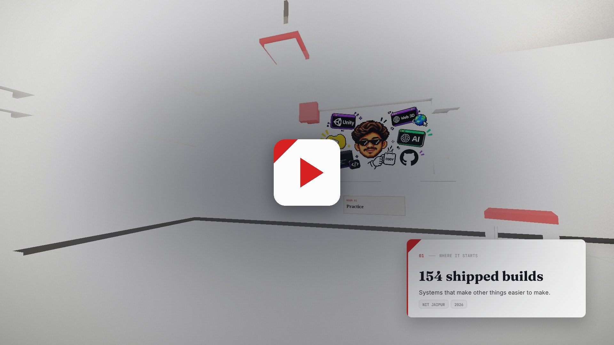

# portfolio

> A portfolio you walk through, not one you scroll.
> **Live → [itsaayush2004.github.io/portfolio](https://itsaayush2004.github.io/portfolio/)**

<p align="center">
  <a href="https://github.com/itsAayush2004/portfolio/blob/main/media/trailer.mp4">
    
  </a>
  <br>
  <em>▶︎ 40 seconds — the walk through all eight rooms</em>
</p>

You come in through a door. Scrolling moves a camera forward through eight rooms laid out on a
serpentine plan. Each room hangs one piece of work on its wall with a name plate under it, has
furniture that belongs to what the room is about, and a built doorway ahead naming whatever is next.
The camera turns to face whichever wall the piece is on. The copy rides over the top on a card that
lands as you arrive.

Built as a single self-contained `index.html` — no build step, no bundler, nothing to install.
Three.js loads from a CDN; every wall, frame, lamp and chair is drawn at runtime.

---

## Contents

| Room | Section | What's in it |
|---|---|---|
| 00 | Lobby | Intro, and the doors to everywhere else |
| 01 | Practice | What I actually build, and why |
| 02 | **Arthis.Space / Arthis.Land** | Two live platforms |
| 03 | **HexaBed** | Unity hex terrain engine + editor tooling |
| 04 | **Blender Add-on Suite** | 28 pipeline add-ons |
| 05 | **Systems & Inference** | RAG, FastAPI, GPT-2 from scratch |
| 06 | By the numbers | The counts, measured not estimated |
| 07 | Contact | Where to find me |

Four rooms have a playable cabinet on the wall — Flappy Fird, Trigger Runner, 3072 and Sudoku.
Tap one and the camera docks to the screen; you play the game without leaving the house.

---

## How it works

**Scroll → camera.** The body is `900vh` tall. Scroll normalises to `0…1` and maps linearly to
camera `z`. Travel is locked to room spacing (`END_Z = START_Z - (N-1) * SPACING`) so the camera
always comes to rest exactly at a room's centre — no drift. The value is damped each frame
(`current += (target - current) * 0.075`) so it glides rather than snaps.

**The camera turns.** Each room hangs its piece on one half of a wall. As you enter, the look-at
target eases toward that wall and returns to dead-ahead in the doorways between rooms, weighted by
`smoothstep(1 - |p - i| / 0.5)`.

**The frame fits the picture.** Each room's piece is a real image from `art/`. The plate is 5.5
units wide and takes its height from the image's own aspect, and the voxel surround is built to
whatever that comes to, one course of margin all round — so a 16:9 piece and a 3:2 piece both sit
in a frame cut for them.

**Furnished by theme.** Ten voxel pieces — bed, couch, shelf, server rack, desk, sideboard, easel,
crates, plant, stool — dealt out by what each room is. Every piece is tested before it is placed:
outside the disc the camera walks through, clear of every doorway it travels down, off the wall the
picture hangs on, inside the room, and not touching anything already standing. Anything that fails
is simply not placed, so nothing ever crosses the camera's path.

**Toon shading.** `MeshToonMaterial` with a three-step `DataTexture` ramp on `NearestFilter`, lit by
ambient plus one key so the bands read. Black `EdgesGeometry` outlines on every solid give the
drawn, cel-shaded edge.

**Text lives in the DOM, not the canvas.** WebGL renders the room; every readable word is real HTML
on a card over the top. That keeps the site selectable, searchable, screen-reader friendly, and
legible even if WebGL fails entirely.

**Nothing is fetched for the identity.** The mark — a room in isometric — is an SVG symbol defined
in the page and used in the header and on the loading screen. The tab icon is the same drawing
inlined as a data URI.

**Graceful degradation.**

- No WebGL → the canvas hides itself, the content stands alone on a blueprint grid
- An image fails to load → the hand-drawn poster underneath is already there
- `prefers-reduced-motion` → camera drift, turning, dust and easing all switch off
- Mobile → pixel ratio capped, particles off, cards flow vertically
- Keyboard → arrows and PageUp/PageDown walk room to room

---

## Stack

| | |
|---|---|
| 3D | Three.js r128 |
| Type | Fraunces · Inter · JetBrains Mono |
| Everything else | Vanilla HTML / CSS / JS |
| Hosting | GitHub Pages |

---

## Run locally

```bash
git clone https://github.com/itsAayush2004/portfolio.git
cd portfolio
python -m http.server 8000
```

Then open `http://localhost:8000`.

---

## About

**Aayush Kumar** — Game Developer · AI & Backend Engineer
B.Tech Electronics & Communication, MNIT Jaipur (2026)

- [arthis.space](https://arthis.space) — browser mini-games platform
- [arthis.land](https://arthis.land) — procedural browser city
- [youtube.com/@AKverseOfficial](https://www.youtube.com/@AKverseOfficial)
- akversebusiness@gmail.com

---

## License

MIT — see [LICENSE](LICENSE).

The code is free to reuse. The written content, the artwork in `art/`, the trailer and the personal
details are mine; please swap them for your own.
