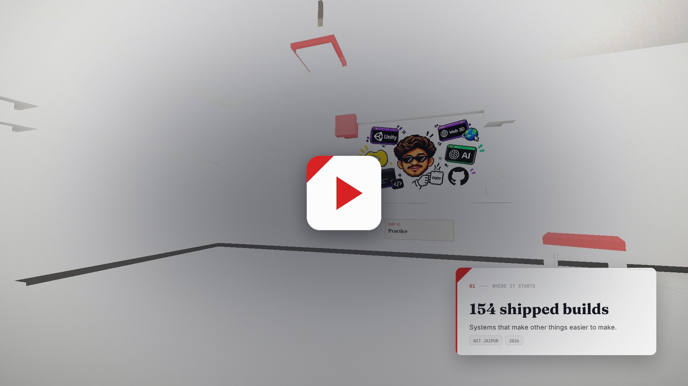

# portfolio

> A portfolio you walk through, not one you scroll.
> **Live → [itsaayush2004.github.io/portfolio](https://itsaayush2004.github.io/portfolio/)**

<p align="center">
  <a href="https://github.com/itsAayush2004/portfolio/blob/main/media/trailer.mp4">
    
  </a>
  <br>
  <em>▶︎ 40 seconds — the walk through all eight rooms</em>
</p>

You come in through a door. Scrolling moves a camera forward through eight rooms laid out on a
serpentine plan. Each room has its own colour, hangs one poster of the work on its wall between a
pair of sconces, has furniture that belongs to what the room is about, a shelf and a little gallery
on its spare wall, and a built doorway ahead naming whatever is next. The camera turns square to the
poster and slides it into the half of the screen the copy card leaves free.

Built as a single self-contained `index.html` — no build step, no bundler, nothing to install.
Three.js loads from a CDN; every wall, frame, lamp and chair is drawn at runtime.

---

## Contents

| Room | Section | What's in it |
|---|---|---|
| 00 | Lobby | Intro, and the doors to everywhere else |
| 01 | Practice | What I actually build, and why |
| 02 | **Arthis.Space / Arthis.Land** | Two live platforms |
| 03 | **HexaBed** | Unity hex terrain engine + editor tooling |
| 04 | **Blender Add-on Suite** | 28 pipeline add-ons |
| 05 | **Systems & Inference** | RAG, FastAPI, GPT-2 from scratch |
| 06 | By the numbers | The counts, measured not estimated |
| 07 | Contact | Where to find me |

Four rooms have a playable cabinet on the wall — Flappy Fird, Trigger Runner, 3072 and Sudoku.
Tap one and the camera docks to the screen; you play the game without leaving the house.

---

## How it works

**Scroll → camera.** The body is `900vh` tall. Scroll normalises to `0…1` and maps linearly to
camera `z`. Travel is locked to room spacing (`END_Z = START_Z - (N-1) * SPACING`) so the camera
always comes to rest exactly at a room's centre — no drift. The value is damped each frame
(`current += (target - current) * 0.075`) so it glides rather than snaps.

**The camera turns.** Each room hangs its piece on one half of a wall. As you enter, the look-at
target eases toward that wall and returns to dead-ahead in the doorways between rooms, weighted by
`smoothstep(1 - |p - i| / 0.5)`. It always lands square on — and then `setViewOffset` slides the
frame sideways so the poster sits beside the card rather than under it.

**The posters are drawn, not photographed.** Each room's piece in `art/` is an isometric voxel
diorama — a cut-away lobby, a workbench, a phone feed beside a tower, a hex island, a rigged figure
on a turntable, server racks, a bar-chart city, an envelope — in the house palette. The source is in
`art/src/`: a tiny isometric renderer that emits SVG, one scene per room, and a script that renders
them to JPEG. The frame is ink with a white mat, built to the picture's own aspect.

**The posters move.** Every scene is drawn as a function of time, and each motion — the cube that
bounces, the feed that swipes, the playhead, the server lights, the plane — is periodic, so the
rendered four-second loops in `media/loops/` close on themselves. The still hangs first; the loop
(WebM, or MP4 where WebM won't play) takes over the moment it is playing, and only the rooms near
you are decoding at any time. Reduced motion keeps the stills.

**Every room has a colour.** A pale wall, a deeper wainscot under a rail, skirting, a crown, a rug
and an accent the furniture picks up — cream, sage, lilac, sky, peach, indigo, butter, blush, each
taken from the room's poster. Each room lines the inside of its own walls, so a wall two rooms share
shows each of them its own colour. Colours are converted from sRGB to linear before they reach the
renderer, so ink reads as ink and the red as red.

**Furnished by theme.** Eleven voxel pieces — bed, couch, shelf, server rack, desk, sideboard, easel,
crates, plant, stool, floor lamp — in oak, walnut and fabric, dealt out by what each room is. Every piece is tested before it is placed:
outside the disc the camera walks through, clear of every doorway it travels down, off the wall the
picture hangs on, inside the room, and not touching anything already standing. Anything that fails
is simply not placed, so nothing ever crosses the camera's path.

**Toon shading.** `MeshToonMaterial` with a three-step `DataTexture` ramp on `NearestFilter`, lit by
ambient plus one key so the bands read. Black `EdgesGeometry` outlines on every solid give the
drawn, cel-shaded edge.

**The interface is built from placards.** Every surface — header, room cards, doors, the walk bar,
the arcade bar, the loading gate — is paper with a 2px ink edge and a hard offset shadow, so the UI
reads as made from the same blocks as the rooms. Each card carries its room's colour on a header band
and ends with the rooms either side; the header shows which of the eight rooms you are standing in.

**Text lives in the DOM, not the canvas.** WebGL renders the room; every readable word is real HTML
on a card over the top. That keeps the site selectable, searchable, screen-reader friendly, and
legible even if WebGL fails entirely.

**Nothing is fetched for the identity.** The mark — a room in isometric — is an SVG symbol defined
in the page and used in the header and on the loading screen. The tab icon is the same drawing
inlined as a data URI.

**Graceful degradation.**

- No WebGL → the canvas hides itself, the content stands alone on a blueprint grid
- An image fails to load → the hand-drawn poster underneath is already there
- Phone, or no WebGL → each room's poster rides at the top of its card instead
- `prefers-reduced-motion` → camera drift, turning, dust and easing all switch off
- Mobile → pixel ratio capped, particles off, cards flow vertically
- Keyboard → arrows and PageUp/PageDown walk room to room

---

## Stack

| | |
|---|---|
| 3D | Three.js r128 |
| Type | Fraunces · Instrument Sans · JetBrains Mono |
| Everything else | Vanilla HTML / CSS / JS |
| Hosting | GitHub Pages |

---

## Run locally

```bash
git clone https://github.com/itsAayush2004/portfolio.git
cd portfolio
python -m http.server 8000
```

Then open `http://localhost:8000`.

---

## About

**Aayush Kumar** — Game Developer · AI & Backend Engineer
B.Tech Electronics & Communication, MNIT Jaipur (2026)

- [arthis.space](https://arthis.space) — browser mini-games platform
- [arthis.land](https://arthis.land) — procedural browser city
- [youtube.com/@AKverseOfficial](https://www.youtube.com/@AKverseOfficial)
- akversebusiness@gmail.com

---

## License

MIT — see [LICENSE](LICENSE).

The code is free to reuse. The written content, the posters in `art/`, the trailer and the personal
details are mine; please swap them for your own (the scenes in `art/src/poster.html` are a good
place to start).
